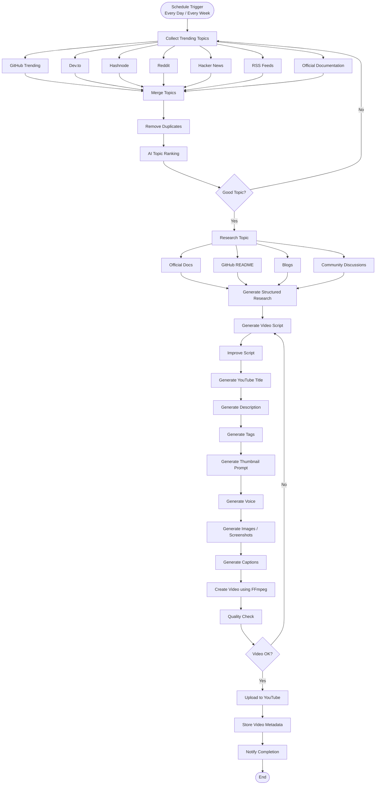

# YouTube AI Automation — Architecture

This document describes the n8n workflow shown below: a scheduled pipeline that finds a
trending software-engineering topic, researches it, writes and refines a script,
generates all video assets, renders and quality-checks the video, and publishes it to
YouTube. It has two feedback loops — one on topic quality, one on video quality — so a
weak topic or a broken render gets sent back for another pass instead of going out the
door.

## Flow Diagram

## Stage-by-Stage Breakdown

### 1. Trigger
**Schedule Trigger** — fires every day or every week (configurable cron). This is the
only entry point into the workflow.

### 2. Topic Discovery
**Collect Trending Topics** fans out to seven free sources in parallel:

| Source | What it contributes |
|---|---|
| GitHub Trending | Newly popular repos and releases |
| Dev.to | Community articles and tutorials |
| Hashnode | Community articles and tutorials |
| Reddit | Discussion-driven topics (r/programming, r/devops, etc.) |
| Hacker News | Front-page tech discussion |
| RSS Feeds | Official engineering blogs (Docker, AWS, Node.js, React, Kubernetes, etc.) |
| Official Documentation | Changelogs and release notes |

All seven branches feed into **Merge Topics**, which combines them into one list. That
list passes through **Remove Duplicates** (drop anything already covered recently) and
then **AI Topic Ranking**, where an LLM scores each candidate for relevance, novelty,
and audience fit.

### 3. Topic Quality Gate
**Good Topic?** is the first decision point.
- **No** → loops back to **Collect Trending Topics** to pull a fresh batch. This is
  what keeps the channel from publishing on a weak or stale topic — it just tries
  again on the next candidate instead of forcing it through.
- **Yes** → proceeds to research.

### 4. Research
**Research Topic** fans out to four sources in parallel — Official Docs, GitHub
README, Blogs, and Community Discussions — each pulling supporting material for the
chosen topic. All four converge into **Generate Structured Research**, which produces
one clean, structured research object (facts, examples, sources) for the script stage
to work from.

### 5. Script & Metadata Generation
This stage runs as a straight sequential chain:

1. **Generate Video Script** — first draft from the structured research
2. **Improve Script** — a revision pass for clarity, pacing, and tone
3. **Generate YouTube Title**
4. **Generate Description**
5. **Generate Tags**
6. **Generate Thumbnail Prompt**

Each of these is a separate, focused AI call rather than one giant prompt — it keeps
each output easy to inspect, regenerate, or swap out independently.

### 6. Media Generation & Rendering
Still sequential from here:

1. **Generate Voice** — text-to-speech narration from the final script
2. **Generate Images / Screenshots** — visuals for each scene
3. **Generate Captions** — subtitle/caption track
4. **Create Video using FFmpeg** — assembles voice + images + captions into the final
   video file

### 7. Video Quality Gate
**Quality Check** inspects the rendered video, then **Video OK?** decides what happens
next:
- **No** → loops back to **Generate Video Script**, so the pipeline retries from the
  script rather than just re-rendering the same broken assets.
- **Yes** → proceeds to publishing.

### 8. Publishing
1. **Upload to YouTube** — publishes the video with the generated title, description,
   tags, and thumbnail
2. **Store Video Metadata** — records the result (video ID, publish time, source
   topic, etc.) for tracking and future duplicate-avoidance
3. **Notify Completion** — sends a notification (Slack/Telegram/email) that the run
   finished
4. **End**

## The Two Feedback Loops, at a Glance

| Gate | Checks | On failure |
|---|---|---|
| Good Topic? | Is the ranked topic relevant, novel, and on-brand enough to build a video around? | Back to Collect Trending Topics — try a different topic |
| Video OK? | Does the rendered video pass quality checks (sync, duration, visual/audio quality)? | Back to Generate Video Script — rebuild from the script forward |

These two gates are what make the pipeline safe to run unattended: nothing reaches
YouTube without first clearing a topic-quality check and a video-quality check.

## Notes for Implementation

- Every fan-out/merge pair (topic sources → Merge Topics; research sources → Generate
  Structured Research) should be built as parallel branches in n8n that reconverge on
  a single Merge node, not a sequential chain — this keeps the run fast.
- The two decision diamonds map to n8n **IF** nodes; each "No" branch should route back
  into the earlier node via n8n's workflow connections (this creates a loop in the
  canvas, which n8n supports natively).
- Consider capping retries on both loops (e.g. max 3 attempts) with a fallback to a
  human-review notification, so a persistently bad topic or a persistently failing
  render doesn't loop forever.
