# AI Content Factory — Production Architecture Blueprint
### Automated Software-Engineering YouTube Content Pipeline (n8n + Local AI)

---

## 0. Executive Summary

This blueprint defines a self-hosted, event-driven **AI Content Factory** that discovers trending software-engineering topics, researches and fact-checks them, writes scripts, generates voice/visuals, renders video, and publishes to multiple platforms — orchestrated primarily through **n8n**, backed by **open-source AI** (Ollama, Piper, Whisper.cpp, Stable Diffusion/Pollinations, FFmpeg), and observable via **Prometheus/Grafana/Loki**. The design favors modular microservice-style "workers" behind n8n orchestration, a Postgres system of record, Redis for queues/cache, and MinIO for object storage — all deployable via Docker Compose and scalable to Kubernetes-style worker pools later.

---

## 1. High-Level Architecture

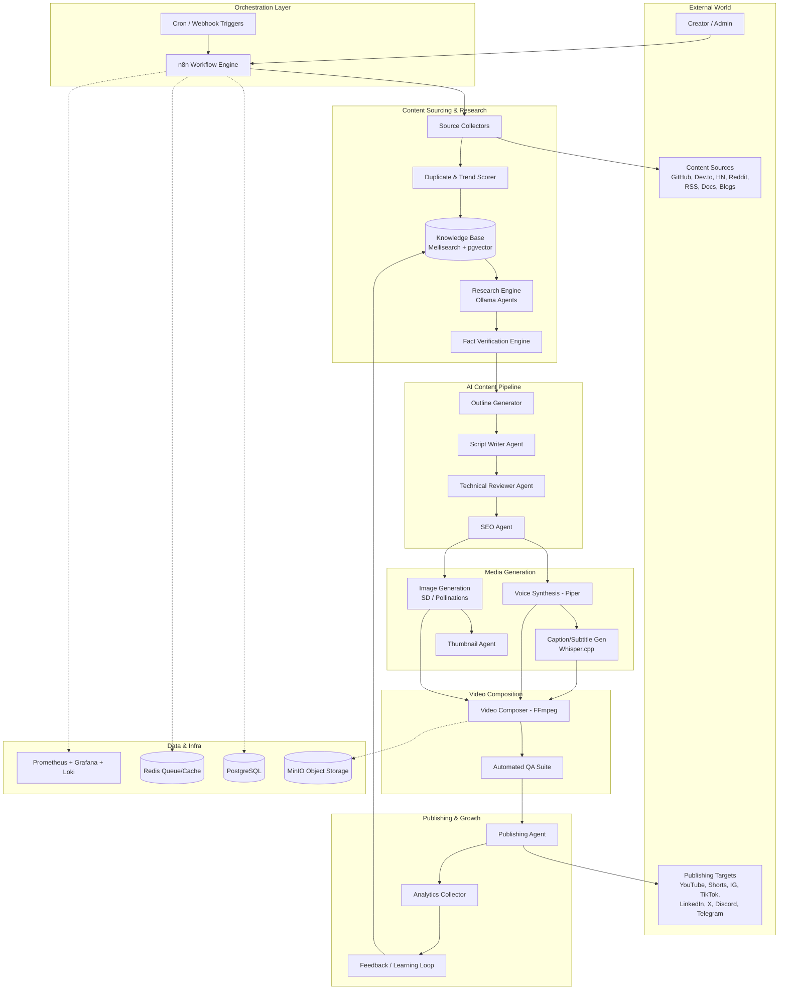

**Design principles:** event-driven hand-offs between stages (via Redis queues/n8n sub-workflows), idempotent workers, every stage persists state to Postgres so any failure is resumable, and every AI step is a swappable "agent" hitting a local Ollama model or a cloud fallback.

---

## 2. Complete Flowchart (Decision-Level)

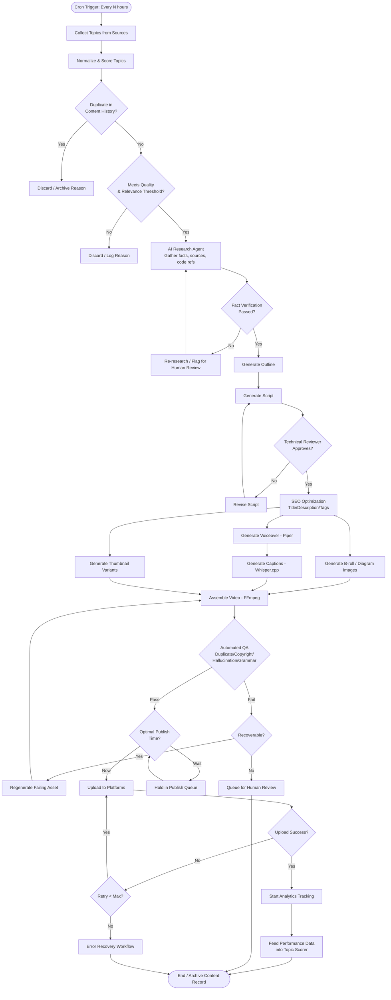

---

## 3. System Modules

Each module is a logical service — can be an n8n sub-workflow, a lightweight Node/Python microservice, or an Ollama-backed agent.

### 3.1 Topic Discovery Module
- **Purpose:** Continuously surface trending, relevant software-engineering topics.
- **Responsibilities:** Poll sources, normalize into a common schema, score by trend velocity + relevance.
- **Input:** RSS feeds, API responses, scraped HTML.
- **Output:** `topics` records with a `trend_score`.
- **Dependencies:** Source Collectors, Meilisearch (dedup search), Postgres.
- **Possible failures:** Source rate-limited, HTML structure changed, API auth expired.
- **Recovery:** Exponential backoff, source-specific circuit breaker, fallback to cached last-known-good feed, alert via Grafana.

### 3.2 Deduplication & Quality Gate
- **Purpose:** Prevent republishing similar content.
- **Responsibilities:** Vector-similarity search against `content_history`, keyword overlap check.
- **Input:** Candidate topic + embedding.
- **Output:** Boolean pass/fail + similarity score.
- **Dependencies:** pgvector/Meilisearch, embedding model (Ollama `nomic-embed-text` or similar).
- **Failures:** Embedding service down.
- **Recovery:** Fallback to fuzzy text match (Levenshtein/trigram) if embeddings unavailable.

### 3.3 Research Engine
- **Purpose:** Gather accurate, well-sourced information on the chosen topic.
- **Responsibilities:** Query docs/APIs/StackOverflow/GitHub, summarize, extract code snippets, cite sources.
- **Input:** Topic + source URLs.
- **Output:** Structured research JSON (facts, citations, code examples, confidence scores).
- **Dependencies:** Ollama (Qwen/DeepSeek reasoning models), web-fetch nodes, GitHub/StackExchange APIs.
- **Failures:** Hallucinated facts, source unreachable.
- **Recovery:** Cross-check with ≥2 independent sources; if confidence < threshold, route to Fact Verification with human-review flag.

### 3.4 Fact Verification Engine
- **Purpose:** Reduce hallucination risk before scripting.
- **Responsibilities:** Re-derive each claim against source text; flag unsupported claims.
- **Input:** Research JSON.
- **Output:** Annotated JSON with `verified: true/false` per claim.
- **Dependencies:** Separate "Fact Checker" LLM agent (different model than Research Agent, to avoid self-confirmation bias).
- **Failures:** Verifier disagrees with researcher persistently.
- **Recovery:** Escalate to human review queue after 2 failed reconciliation attempts.

### 3.5 Script Generation Module
- **Purpose:** Turn verified research into a narratable script.
- **Responsibilities:** Structure hook/body/CTA, target run-time, match channel tone.
- **Input:** Verified research JSON + outline.
- **Output:** Timed script with scene markers `[SCENE: diagram, code, talking-head]`.
- **Dependencies:** Script Writer Agent (Ollama), style guide prompt.
- **Failures:** Script too long/short, off-brand tone.
- **Recovery:** Automatic length-trim pass; regenerate with adjusted temperature if reviewer rejects twice.

### 3.6 Technical Review Module
- **Purpose:** Catch technical inaccuracies a general fact-checker might miss (e.g., wrong API syntax).
- **Responsibilities:** Run script through a code-specialized model; validate any code blocks by static lint/compile where feasible.
- **Input:** Script.
- **Output:** Approval + inline correction suggestions.
- **Dependencies:** Ollama code model (e.g., Qwen-Coder), sandboxed linter/compiler containers.
- **Failures:** False positives on stylistic code choices.
- **Recovery:** Confidence-weighted auto-accept above threshold; else human queue.

### 3.7 SEO Module
- **Purpose:** Maximize discoverability.
- **Responsibilities:** Generate title variants, description, tags, hashtags, chapters.
- **Input:** Final script + topic metadata.
- **Output:** SEO package JSON.
- **Dependencies:** SEO Agent, keyword-trend data (Google Trends scrape / YouTube autocomplete scrape).
- **Failures:** Keyword API blocked.
- **Recovery:** Fallback to static keyword bank per category.

### 3.8 Voice Synthesis Module
- **Purpose:** Produce narration audio.
- **Responsibilities:** TTS via Piper, apply pacing/SSML-like pauses at scene markers.
- **Input:** Script text.
- **Output:** WAV/MP3 + timestamp map.
- **Dependencies:** Piper voice models.
- **Failures:** Mispronunciation of technical terms.
- **Recovery:** Pronunciation dictionary override table; manual correction queue for repeat offenders.

### 3.9 Image/B-Roll Generation Module
- **Purpose:** Visual diagrams, code screenshots, abstract tech visuals.
- **Responsibilities:** Prompt-to-image via Pollinations (free) or local Stable Diffusion; generate architecture diagrams via Mermaid-to-SVG render for code-accurate visuals.
- **Input:** Scene markers from script.
- **Output:** PNG/SVG assets keyed by scene ID.
- **Dependencies:** SD/Pollinations API, Mermaid CLI (for technically-accurate diagrams — preferred over pure image-gen for architecture scenes).
- **Failures:** NSFW/irrelevant generations.
- **Recovery:** Content-safety filter + regeneration retry (max 3), fallback to stock diagram template.

### 3.10 Thumbnail Module
- **Purpose:** Generate high-CTR thumbnail variants.
- **Responsibilities:** Compose title text + generated art + brand template.
- **Input:** Title + key visual.
- **Output:** 2–3 thumbnail variants for A/B testing.
- **Dependencies:** Thumbnail Agent, image compositor (Sharp/ImageMagick).
- **Failures:** Text overflow, low contrast.
- **Recovery:** Template-driven auto-layout with contrast-check validation.

### 3.11 Caption/Subtitle Module
- **Purpose:** Accessibility + platform requirement (captions boost retention).
- **Responsibilities:** Force-align audio to script via Whisper.cpp, export SRT/VTT.
- **Input:** Audio + script.
- **Output:** SRT/VTT files.
- **Dependencies:** Whisper.cpp.
- **Failures:** Misalignment on accents/technical jargon.
- **Recovery:** Use script text as ground truth, Whisper only for timing.

### 3.12 Video Composer Module
- **Purpose:** Assemble final video.
- **Responsibilities:** Sequence audio/visuals/captions/thumbnail per scene timeline; apply transitions, lower-thirds, background music (royalty-free).
- **Input:** All media assets + timing map.
- **Output:** MP4 (multiple aspect ratios: 16:9, 9:16, 1:1).
- **Dependencies:** FFmpeg, asset store (MinIO).
- **Failures:** Audio/video desync, codec errors.
- **Recovery:** Automated desync detection (compare durations), re-render with corrected offsets.

### 3.13 QA Module
- **Purpose:** Final automated gate before publishing.
- **Responsibilities:** Duplicate-content check, copyright audio/image match, hallucination re-scan, grammar/readability score, platform policy compliance scan.
- **Input:** Final video + metadata.
- **Output:** Pass/fail + report.
- **Dependencies:** Audio fingerprinting (Chromaprint), text QA agent, policy-keyword filters.
- **Failures:** False positive copyright flags.
- **Recovery:** Human review queue; whitelist known royalty-free assets.

### 3.14 Publishing Module
- **Purpose:** Multi-platform distribution.
- **Responsibilities:** Format per platform, schedule per optimal-time model, upload via APIs.
- **Input:** Approved video + SEO package.
- **Output:** Platform post IDs + status.
- **Dependencies:** YouTube Data API, Meta Graph API, LinkedIn API, X API, Discord/Telegram bots.
- **Failures:** API quota exhausted, auth token expired.
- **Recovery:** Queue + retry with backoff; token refresh workflow; alert on repeated failure.

### 3.15 Analytics Module
- **Purpose:** Track performance for the feedback loop.
- **Responsibilities:** Pull views/CTR/retention per platform on a schedule.
- **Input:** Post IDs.
- **Output:** `analytics` records over time.
- **Dependencies:** Platform analytics APIs.
- **Failures:** API rate limits.
- **Recovery:** Staggered polling schedule per platform.

### 3.16 Feedback/Learning Loop
- **Purpose:** Improve topic scoring and content style over time.
- **Responsibilities:** Correlate topic attributes/style choices with performance; adjust scoring weights.
- **Input:** Analytics + content metadata.
- **Output:** Updated scoring model/config.
- **Dependencies:** Postgres analytics tables, a lightweight scoring recalculation job.
- **Failures:** Overfitting to short-term trends.
- **Recovery:** Rolling-window averaging, human-in-the-loop weight review monthly.

### 3.17 Error Recovery Module
- **Purpose:** Central resilience layer.
- **Responsibilities:** Catch failures from any workflow, classify, retry or escalate.
- **Input:** Error events (workflow name, node, payload, stack).
- **Output:** `errors` table entries, alerts, retry triggers.
- **Dependencies:** n8n Error Trigger nodes, Redis dead-letter queue.
- **Failures:** Cascading failures.
- **Recovery:** Circuit breaker per external dependency; alert thresholds in Grafana.

---

## 4. Data Flow

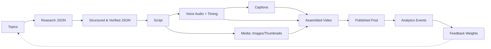

All intermediate artifacts are persisted as immutable rows keyed by `content_id` (UUID) so any stage can be replayed without recomputation — this is the backbone of the recovery strategy across every module.

---

## 5. n8n Workflow Breakdown

> Naming convention: `WF-<n>-<Name>`. Each workflow is triggered either by cron, webhook, or a "Execute Workflow" call from an upstream workflow, and ends by writing status to Postgres and, on failure, invoking `WF-10-Error-Recovery` via an Error Trigger.

### WF-1 — Topic Discovery
1. Cron Trigger (every 4h)
2. HTTP Request — GitHub Trending (scrape/API)
3. HTTP Request — Dev.to API
4. HTTP Request — Hashnode API
5. RSS Feed Read (multiple: Hacker News, blogs)
6. HTTP Request — Reddit API (r/programming, r/devops, etc.)
7. Function/Code Node — Normalize schema
8. Function/Code Node — Score trend velocity
9. Postgres — Upsert into `topics`
10. Execute Workflow — trigger `WF-2` for top N unscored topics

### WF-2 — Research
1. Execute Workflow Trigger (from WF-1) / Webhook
2. Postgres — Fetch topic details
3. HTTP Request — Fetch official docs/StackOverflow/GitHub README
4. Ollama Node (HTTP Request to local Ollama API) — Research Agent prompt
5. Function Node — Parse/structure JSON
6. Postgres — Insert into `research`
7. Execute Workflow — trigger `WF-3`

### WF-3 — Fact Checking
1. Execute Workflow Trigger
2. Postgres — Fetch research JSON
3. Ollama Node — Fact Checker Agent (separate model)
4. IF Node — confidence < threshold?
   - True → Postgres update `status = needs_review` → Slack/Telegram notify human
   - False → continue
5. Postgres — Update `research.verified = true`
6. Execute Workflow — trigger `WF-4`

### WF-4 — Script Generation
1. Execute Workflow Trigger
2. Postgres — Fetch verified research
3. Ollama Node — Outline Agent
4. Ollama Node — Script Writer Agent
5. Ollama Node — Technical Reviewer Agent
6. IF Node — Reviewer approved?
   - False → Loop back to Script Writer (max 2 retries) → else human queue
7. Ollama Node — SEO Agent (title/description/tags)
8. Postgres — Insert into `scripts`
9. Execute Workflow — trigger `WF-5`

### WF-5 — Asset Generation
1. Execute Workflow Trigger
2. Postgres — Fetch script + scene markers
3. HTTP Request — Piper TTS service (voice)
4. HTTP Request — Whisper.cpp service (captions/timing)
5. HTTP Request — Pollinations/SD image service (per scene)
6. Code Node — Mermaid CLI render for architecture/diagram scenes
7. Ollama Node — Thumbnail Agent (prompt + text overlay spec)
8. HTTP Request/Code Node — Compose thumbnail (Sharp)
9. MinIO — Upload all assets
10. Postgres — Insert into `assets`, `voice`
11. Execute Workflow — trigger `WF-6`

### WF-6 — Video Rendering
1. Execute Workflow Trigger
2. MinIO — Download assets
3. Code Node — Build FFmpeg command/timeline from scene map
4. Execute Command Node — Run FFmpeg (render 16:9, 9:16, 1:1 variants)
5. Code Node — Automated QA checks (duration match, black-frame detection)
6. HTTP Request — Chromaprint/audio-fingerprint copyright check
7. Ollama Node — Hallucination re-scan against source research
8. IF Node — QA passed?
   - False → branch to regenerate failing asset (loop to WF-5 node) or human queue
9. MinIO — Upload final renders
10. Postgres — Insert into `videos`
11. Execute Workflow — trigger `WF-7`

### WF-7 — Publishing
1. Execute Workflow Trigger / Cron (checks publish queue every 15 min)
2. Postgres — Fetch approved videos due for publishing
3. Switch Node — per platform branch
4. HTTP Request — YouTube Data API upload
5. HTTP Request — Instagram/TikTok/LinkedIn/X APIs
6. HTTP Request — Discord/Telegram bot post
7. Postgres — Update `publishing_status`
8. Error Trigger → `WF-10`
9. Execute Workflow — trigger `WF-8` (start analytics tracking)

### WF-8 — Analytics
1. Cron Trigger (hourly/daily staggered per platform)
2. Postgres — Fetch active post IDs
3. HTTP Request — YouTube Analytics API
4. HTTP Request — other platform analytics APIs
5. Postgres — Insert/update `analytics`
6. Execute Workflow — trigger `WF-9` feedback recalculation weekly

### WF-9 — Content Archive & Feedback
1. Cron Trigger (weekly)
2. Postgres — Aggregate analytics by topic category/style attributes
3. Code Node — Recalculate topic-scoring weights
4. Postgres — Update scoring config table
5. Postgres — Move completed content records to `content_history` (long-term archive)

### WF-10 — Error Recovery
1. Error Trigger (global, attached to all workflows)
2. Code Node — Classify error (transient vs permanent, which dependency)
3. Redis — Push to dead-letter queue with backoff metadata
4. IF Node — retries < max?
   - True → Wait (exponential backoff) → Execute Workflow (re-invoke failed step)
   - False → Postgres insert into `errors` → Slack/Telegram alert to admin
5. Prometheus — Increment error-counter metric (via Pushgateway)

---

## 6. AI Agents

| Agent | Model (Ollama) | Responsibility |
|---|---|---|
| Topic Discovery Agent | Gemma (lightweight) | Score/classify raw feed items by relevance & novelty |
| Research Agent | Qwen or DeepSeek (large context) | Gather and summarize facts with citations |
| Fact Checker | Different model than Research Agent | Independently verify each claim against sources |
| Technical Reviewer | Qwen-Coder / DeepSeek-Coder | Validate code correctness, terminology accuracy |
| Script Writer | Llama or Qwen (creative-tuned) | Convert outline into narratable script with tone |
| SEO Agent | Gemma/Llama (fast) | Titles, descriptions, tags, hashtags |
| Thumbnail Agent | Gemma + image model | Compose visual + text-overlay spec for thumbnails |
| Voice Agent | Piper (not an LLM — deterministic TTS) | Narration synthesis with pacing control |
| Video Director | Rule-based + LLM assist | Decide scene pacing, transitions, visual pairing |
| Publishing Agent | Rule-based | Platform-specific formatting & scheduling logic |
| Analytics Agent | Rule-based + Gemma summarizer | Summarize performance trends in plain language |
| Feedback Agent | Statistical (non-LLM) | Recompute topic-scoring weights from outcomes |
| Memory Agent | Embedding model + pgvector | Maintain long-term knowledge base, prevent repetition |
| Trend Prediction Agent | Qwen + time-series heuristics | Forecast which topics will trend before they peak |

All agents are invoked as HTTP calls to a local **Ollama** instance (`POST /api/generate` or `/api/chat`) from n8n, with prompts pulled from the **Prompt Library** (Section 10) and versioned in Postgres so prompt changes are auditable.

---

## 7. Content Sources & Access Strategy

| Source | Access Method | Notes |
|---|---|---|
| GitHub Trending | Unofficial trending scrape or GitHub Search API (`/search/repositories?sort=stars`) | No official trending endpoint; scrape `github.com/trending` HTML or use search API as proxy |
| Dev.to | Official REST API (`/api/articles`) | Free, no key required for public reads |
| Hashnode | Public GraphQL API | Free |
| RSS (generic) | Standard RSS/Atom parsing | Use for any blog with a feed (Node.js, React, Kubernetes, Cloudflare, AWS, Docker blogs typically expose `/feed`) |
| Hacker News | Official Firebase API (`hacker-news.firebaseio.com`) | Free, no key |
| Reddit | Official API (OAuth, free tier) | Respect rate limits; use `r/programming`, `r/devops`, `r/MachineLearning` |
| Official Documentation | Scrape changelogs/release notes pages | Track diffs for "what's new" content |
| Stack Overflow Blog | RSS | Free |
| Docker Blog | RSS | Free |
| AWS Blog | RSS (per-category feeds) | Free |
| Google Developers Blog | RSS | Free |
| Microsoft Learn / Azure Blog | RSS | Free |
| Cloudflare Blog | RSS | Free |
| Node.js Blog | RSS | Free |
| React Blog | RSS | Free |
| Kubernetes Blog | RSS | Free |
| Linux Foundation | RSS | Free |
| NPM Trending | `npm-stat` / registry download-count API | Free |
| PyPI | PyPI JSON API + BigQuery public dataset (optional) | Free |
| Awesome GitHub Lists | Scrape curated `awesome-*` repos' READMEs | Free, high signal for niche trends |

**Scraping etiquette:** respect `robots.txt`, cache aggressively in Redis (TTL 1–6h), identify with a proper User-Agent, and prefer official APIs over HTML scraping wherever one exists.

---

## 8. Database Design (PostgreSQL)

```sql
-- Topics discovered from sources
CREATE TABLE topics (
    id UUID PRIMARY KEY DEFAULT gen_random_uuid(),
    title TEXT NOT NULL,
    source_id UUID REFERENCES sources(id),
    raw_summary TEXT,
    category TEXT,
    trend_score NUMERIC,
    embedding VECTOR(768),
    status TEXT DEFAULT 'new', -- new, researching, scripted, published, discarded
    created_at TIMESTAMPTZ DEFAULT now()
);

-- Content sources registry
CREATE TABLE sources (
    id UUID PRIMARY KEY DEFAULT gen_random_uuid(),
    name TEXT NOT NULL,
    type TEXT, -- rss, api, scrape
    url TEXT,
    last_polled_at TIMESTAMPTZ,
    is_active BOOLEAN DEFAULT true
);

-- Research output per topic
CREATE TABLE research (
    id UUID PRIMARY KEY DEFAULT gen_random_uuid(),
    topic_id UUID REFERENCES topics(id),
    content JSONB NOT NULL,       -- structured facts + citations
    confidence NUMERIC,
    verified BOOLEAN DEFAULT false,
    created_at TIMESTAMPTZ DEFAULT now()
);

-- Generated scripts
CREATE TABLE scripts (
    id UUID PRIMARY KEY DEFAULT gen_random_uuid(),
    research_id UUID REFERENCES research(id),
    outline JSONB,
    script_text TEXT NOT NULL,
    seo_title TEXT,
    seo_description TEXT,
    seo_tags TEXT[],
    reviewer_approved BOOLEAN DEFAULT false,
    version INT DEFAULT 1,
    created_at TIMESTAMPTZ DEFAULT now()
);

-- Generated media assets (images, thumbnails)
CREATE TABLE assets (
    id UUID PRIMARY KEY DEFAULT gen_random_uuid(),
    script_id UUID REFERENCES scripts(id),
    asset_type TEXT, -- image, thumbnail, diagram
    storage_path TEXT NOT NULL, -- MinIO path
    scene_id TEXT,
    created_at TIMESTAMPTZ DEFAULT now()
);

-- Voice/narration output
CREATE TABLE voice (
    id UUID PRIMARY KEY DEFAULT gen_random_uuid(),
    script_id UUID REFERENCES scripts(id),
    storage_path TEXT NOT NULL,
    duration_seconds NUMERIC,
    timing_map JSONB,
    created_at TIMESTAMPTZ DEFAULT now()
);

-- Final rendered videos
CREATE TABLE videos (
    id UUID PRIMARY KEY DEFAULT gen_random_uuid(),
    script_id UUID REFERENCES scripts(id),
    variant TEXT, -- 16:9, 9:16, 1:1
    storage_path TEXT NOT NULL,
    qa_passed BOOLEAN DEFAULT false,
    qa_report JSONB,
    created_at TIMESTAMPTZ DEFAULT now()
);

-- Publishing status per platform
CREATE TABLE publishing_status (
    id UUID PRIMARY KEY DEFAULT gen_random_uuid(),
    video_id UUID REFERENCES videos(id),
    platform TEXT NOT NULL, -- youtube, tiktok, instagram, linkedin, x, discord, telegram
    platform_post_id TEXT,
    status TEXT DEFAULT 'pending', -- pending, published, failed
    scheduled_at TIMESTAMPTZ,
    published_at TIMESTAMPTZ,
    error_message TEXT
);

-- Analytics per published post
CREATE TABLE analytics (
    id UUID PRIMARY KEY DEFAULT gen_random_uuid(),
    publishing_status_id UUID REFERENCES publishing_status(id),
    views BIGINT DEFAULT 0,
    likes BIGINT DEFAULT 0,
    comments BIGINT DEFAULT 0,
    ctr NUMERIC,
    avg_watch_seconds NUMERIC,
    recorded_at TIMESTAMPTZ DEFAULT now()
);

-- Error log for recovery workflow
CREATE TABLE errors (
    id UUID PRIMARY KEY DEFAULT gen_random_uuid(),
    workflow_name TEXT,
    node_name TEXT,
    payload JSONB,
    error_message TEXT,
    retry_count INT DEFAULT 0,
    resolved BOOLEAN DEFAULT false,
    created_at TIMESTAMPTZ DEFAULT now()
);

-- Human feedback / manual review notes
CREATE TABLE user_feedback (
    id UUID PRIMARY KEY DEFAULT gen_random_uuid(),
    content_id UUID, -- generic FK to topics/scripts/videos
    content_type TEXT,
    reviewer TEXT,
    decision TEXT, -- approved, rejected, edited
    notes TEXT,
    created_at TIMESTAMPTZ DEFAULT now()
);

-- Long-term archive to prevent repeats
CREATE TABLE content_history (
    id UUID PRIMARY KEY DEFAULT gen_random_uuid(),
    topic_id UUID REFERENCES topics(id),
    video_id UUID REFERENCES videos(id),
    embedding VECTOR(768),
    archived_at TIMESTAMPTZ DEFAULT now()
);
```

Indexes: GIN on `scripts.seo_tags`, ivfflat/HNSW index on all `VECTOR(768)` columns (pgvector), btree on `status` columns used in polling queries.

---

## 9. Folder Structure

```
ai-content-factory/
├── backend/
│   ├── src/
│   │   ├── modules/
│   │   │   ├── topics/
│   │   │   ├── research/
│   │   │   ├── scripts/
│   │   │   ├── assets/
│   │   │   ├── publishing/
│   │   │   └── analytics/
│   │   ├── shared/
│   │   │   ├── db/            # Postgres client, migrations
│   │   │   ├── queue/         # Redis/BullMQ helpers
│   │   │   ├── storage/       # MinIO client
│   │   │   └── ollama/        # Ollama HTTP client wrapper
│   │   └── main.ts
│   └── package.json
├── frontend/                  # Admin dashboard (review queue, analytics)
│   ├── src/
│   │   ├── pages/
│   │   ├── components/
│   │   └── api/
│   └── package.json
├── workers/
│   ├── voice-worker/           # Piper wrapper service
│   ├── image-worker/           # SD/Pollinations wrapper
│   ├── caption-worker/         # Whisper.cpp wrapper
│   ├── render-worker/          # FFmpeg composition service
│   └── qa-worker/              # Copyright/hallucination/grammar checks
├── n8n/
│   ├── workflows/
│   │   ├── wf-1-topic-discovery.json
│   │   ├── wf-2-research.json
│   │   ├── wf-3-fact-checking.json
│   │   ├── wf-4-script-generation.json
│   │   ├── wf-5-asset-generation.json
│   │   ├── wf-6-video-rendering.json
│   │   ├── wf-7-publishing.json
│   │   ├── wf-8-analytics.json
│   │   ├── wf-9-archive-feedback.json
│   │   └── wf-10-error-recovery.json
│   └── credentials/            # (gitignored) n8n credential exports
├── docker/
│   ├── docker-compose.yml
│   ├── docker-compose.prod.yml
│   ├── n8n.Dockerfile
│   ├── ollama.Dockerfile
│   └── monitoring/
│       ├── prometheus.yml
│       ├── grafana/
│       └── loki-config.yml
├── assets/
│   ├── brand/                  # logo, fonts, intro/outro clips
│   └── music/                  # royalty-free background tracks
├── prompts/
│   ├── topic_discovery.md
│   ├── research.md
│   ├── fact_checking.md
│   ├── script_writing.md
│   ├── seo.md
│   ├── thumbnail.md
│   └── social_copy.md
├── templates/
│   ├── thumbnail-templates/
│   └── video-templates/        # FFmpeg filter-graph templates
├── database/
│   ├── migrations/
│   └── seeds/
├── scripts/
│   ├── setup.sh
│   ├── backup-db.sh
│   └── deploy.sh
├── logs/                       # local dev logs (prod uses Loki)
└── README.md
```

---

## 10. AI Prompt Library

> Stored as versioned files under `prompts/`, loaded by n8n via Postgres or file read, with `{{variables}}` interpolated before sending to Ollama.

**Topic Discovery**
```
You are a technical trend analyst for a software engineering YouTube channel.
Given this raw feed item: {{raw_item}}
Score its relevance (0-10) for an audience of full-stack developers, DevOps engineers,
and system designers. Consider novelty, technical depth, and search demand.
Return JSON: {"relevance": <int>, "category": "<string>", "reason": "<string>"}
```

**Research**
```
You are a senior software engineer researching "{{topic_title}}" for an educational video.
Using only the provided source excerpts: {{sources}}
Extract: (1) core technical facts, (2) at least one real code example if applicable,
(3) common misconceptions, (4) citation for each fact.
Return structured JSON only, no prose.
```

**Fact Checking**
```
You are an independent fact-checker. You did not write the following research.
Research claims: {{research_json}}
Original sources: {{sources}}
For each claim, mark verified true/false and explain briefly if false.
Flag any claim not directly supported by the sources as unverified.
```

**Script Writing**
```
Write a {{duration_minutes}}-minute YouTube script on "{{topic_title}}" for developers.
Tone: {{channel_tone}}. Use the verified research below, do not invent facts: {{research_json}}
Structure: Hook (10s) -> Problem -> Explanation with code/diagram cues -> Recap -> CTA.
Mark visual cues as [SCENE: description]. Return script text with scene markers.
```

**SEO**
```
Given this script summary: {{script_summary}}
Generate: 5 title variants (<60 chars, high-CTR, no clickbait falsehoods),
1 description (150-300 words with keywords and links placeholder),
15 tags, 5 hashtags. Return as JSON.
```

**Thumbnail**
```
Given the video title "{{title}}" and topic "{{topic}}", describe a thumbnail concept:
main visual subject, background style, 3-5 word overlay text, color palette.
Optimize for high contrast and clarity at small sizes. Return JSON spec.
```

**Title (standalone variant generator)**
```
Generate 8 alternative YouTube titles for a video about "{{topic}}" that are accurate,
non-clickbait, and under 60 characters. Return as a JSON array of strings.
```

**Description**
```
Write a YouTube description for "{{title}}" covering: what viewers will learn,
timestamps placeholder, relevant links placeholder, and a natural call-to-subscribe.
Keep it factual and under 300 words.
```

**Hashtags**
```
Generate 5 relevant, non-spammy hashtags for a video about "{{topic}}" targeting
developers on YouTube/Instagram/TikTok. Return as a JSON array.
```

**Comments (auto-pinned comment generator)**
```
Write a short pinned comment (<40 words) for the video "{{title}}" that adds one
extra useful tip or resource link placeholder, encouraging discussion.
```

**Community Post**
```
Write a short community-tab post (<150 chars) teasing the topic "{{topic}}"
1 day before the video launches, ending with a question to drive comments.
```

---

## 11. Quality Assurance Pipeline

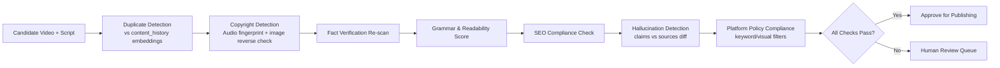

| Check | Method | Tooling |
|---|---|---|
| Duplicate Detection | Cosine similarity on embeddings vs `content_history` | pgvector |
| Copyright Detection | Audio fingerprint match; reverse image search on generated assets | Chromaprint, perceptual hashing |
| Fact Verification | Re-diff script claims against original research citations | Ollama Fact Checker agent |
| Grammar | Rule-based + LLM grammar pass | LanguageTool (self-hosted, free) |
| Readability | Flesch-Kincaid scoring | Local scoring library |
| SEO | Title length, keyword presence, tag count validation | Rule-based Function node |
| Hallucination Detection | Compare final script sentences against verified-fact set; flag unsupported additions introduced during revision | Ollama agent diff |
| Policy Compliance | Keyword/visual blocklist scan per platform's community guidelines | Rule-based filters + LLM classifier |

---

## 12. Technology Stack

| Layer | Tool | License |
|---|---|---|
| Orchestration | n8n | Fair-code (free self-hosted) |
| LLM Runtime | Ollama | MIT |
| Models | Qwen, Llama, DeepSeek, Gemma | Open weights |
| Voice Synthesis | Piper | MIT |
| Speech Recognition/Alignment | Whisper.cpp | MIT |
| Image Generation | Pollinations (free API), Stable Diffusion (self-hosted) | Open/free |
| Video Rendering | FFmpeg | LGPL/GPL |
| Database | PostgreSQL (+ pgvector) | PostgreSQL License |
| Cache/Queue | Redis | BSD |
| Object Storage | MinIO | AGPL (self-hosted) |
| Search | Meilisearch | MIT |
| Monitoring | Prometheus + Grafana | Apache 2.0 / AGPL |
| Logging | Loki | AGPL |
| Containerization | Docker | Apache 2.0 |
| Deployment | Docker Compose (→ optional K8s later) | Apache 2.0 |
| Grammar Check | LanguageTool (self-hosted) | LGPL |

---

## 13. Scalability Roadmap

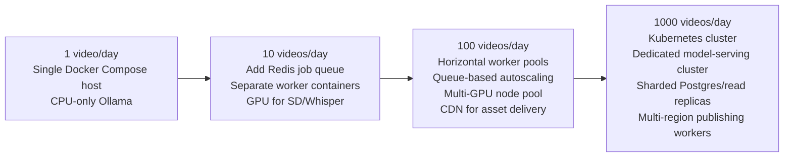

- **Queueing:** Move from n8n's internal execution queue to Redis + BullMQ-backed worker services once volume exceeds ~10/day, so n8n only orchestrates while heavy compute (render, TTS, image-gen) runs in dedicated worker pods.
- **Workers:** Stateless worker containers (voice, image, render) scale horizontally behind a queue; each pulls jobs, processes, writes to MinIO, acks.
- **Caching:** Redis caches source-feed responses, embedding lookups, and rendered Mermaid diagrams to avoid recomputation.
- **GPU workers:** Dedicated GPU node pool for Stable Diffusion and Whisper.cpp batch jobs at 100+/day; CPU-only Ollama models remain viable for text tasks even at scale if using efficient quantized models (Q4/Q5 GGUF).
- **Horizontal scaling:** At 1000/day, split Postgres into read-replicas for analytics queries, shard object storage by month/category, and run multiple regional publishing workers to respect per-platform rate limits.

---

## 14. Security

| Concern | Mitigation |
|---|---|
| API Keys / Secrets | Store in Docker secrets / n8n credential vault (encrypted at rest); never in workflow JSON or repo |
| Authentication | Admin dashboard behind SSO/OAuth2 (e.g., self-hosted Keycloak or simple JWT auth for solo operator) |
| Rate Limiting | Per-source and per-platform rate limiters (Redis token bucket) to avoid bans |
| Sandboxing | Run code-linting/compile checks for the Technical Reviewer inside ephemeral, network-isolated containers |
| Content Moderation | LLM classifier + keyword blocklist pass before publishing (Section 11) |
| Copyright Protection | Fingerprint-check all generated audio/image assets against known copyrighted material before use; use only royalty-free music libraries |
| Network Security | Internal services (Ollama, Postgres, Redis, MinIO) bound to a private Docker network, not exposed publicly; only n8n UI and admin dashboard behind reverse proxy with TLS |
| Audit Trail | Every AI generation and human decision logged with prompt version + model version for reproducibility |

---

## 15. Future Features

- Automatic A/B thumbnail testing with click-through feedback loop
- AI avatar presenter (open-source talking-head models) for hybrid narration
- Podcast generation (audio-only repurposing of scripts)
- Newsletter generation summarizing the week's videos
- Blog generation (script → long-form article) for SEO/backlinks
- Multi-language video generation via translation + re-dubbed Piper voices
- Automatic translation of captions/descriptions
- Native YouTube Shorts / Instagram Reels / TikTok short-form cutdown generator
- LinkedIn/X native post generation from video highlights
- Discord/Telegram community auto-posting with engagement bots
- Trend-prediction dashboard surfacing "about to trend" topics before competitors

---

## 16. Final Deliverables

### 16.1 High-Level Architecture — see Section 1

### 16.2 Detailed Flowchart — see Section 2

### 16.3 Sequence Diagram

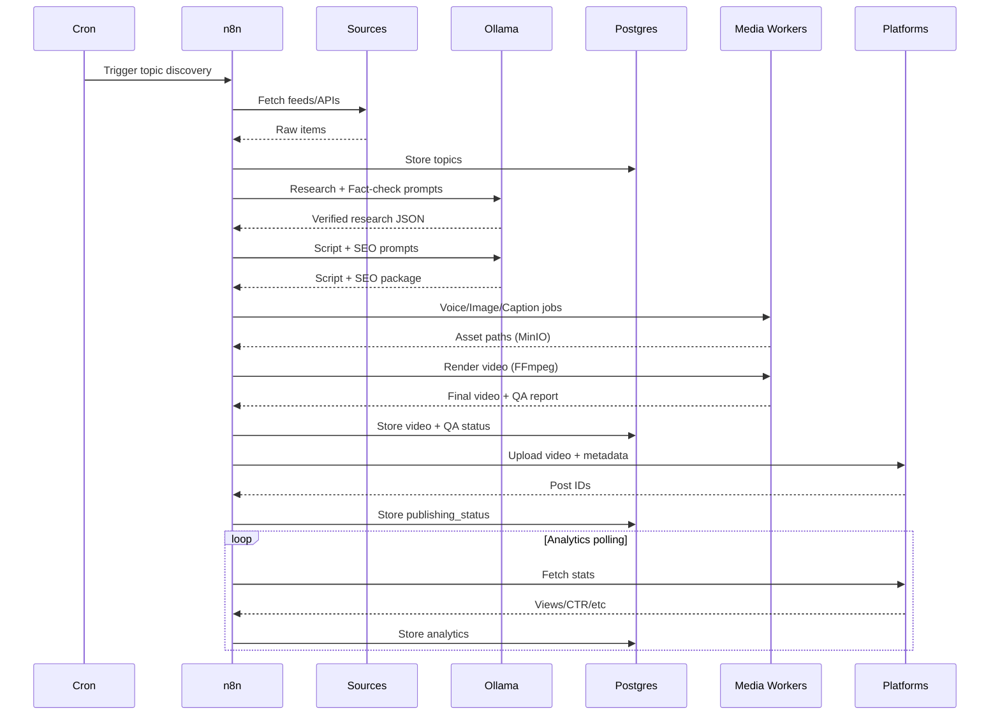

### 16.4 ER Diagram

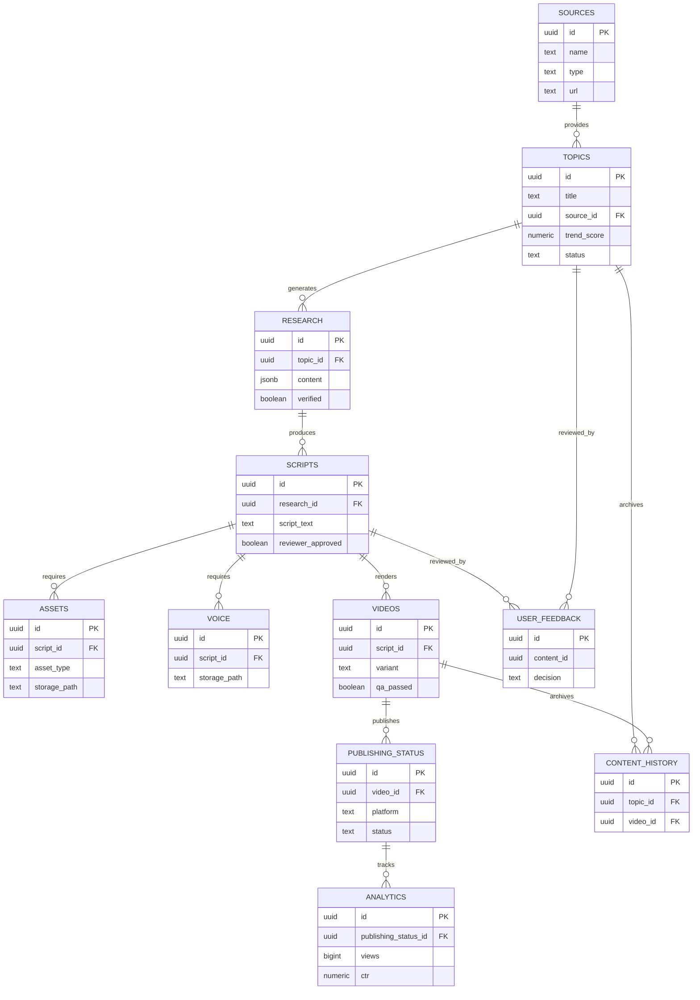

### 16.5 Deployment Diagram

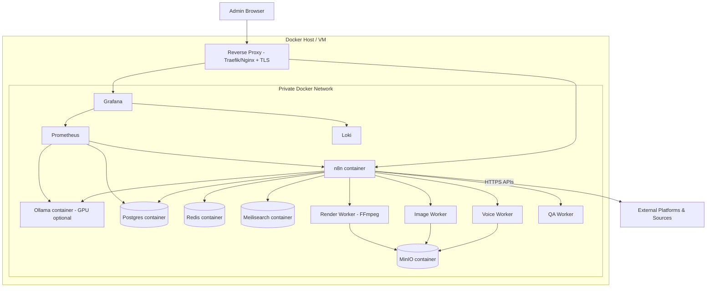

### 16.6 Mind Map

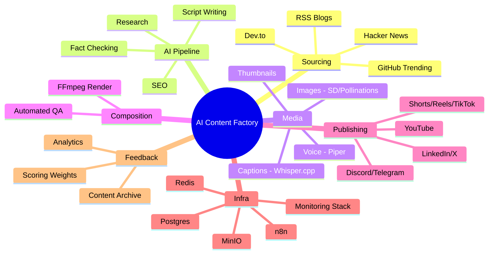

### 16.7 Component Diagram

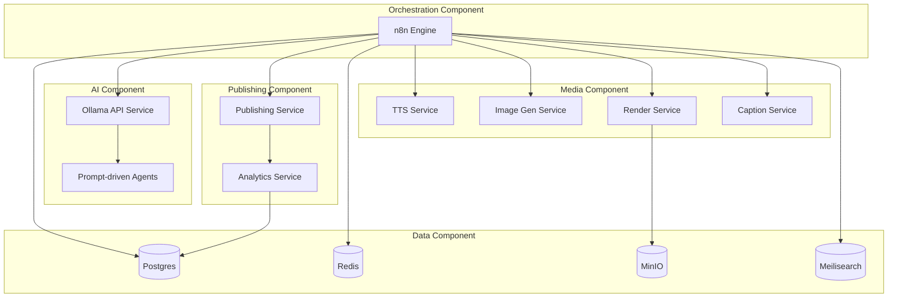

### 16.8 State Diagram (Content Lifecycle)

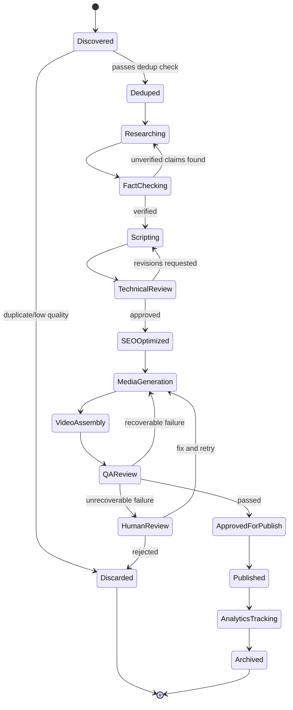

### 16.9 Class Diagram

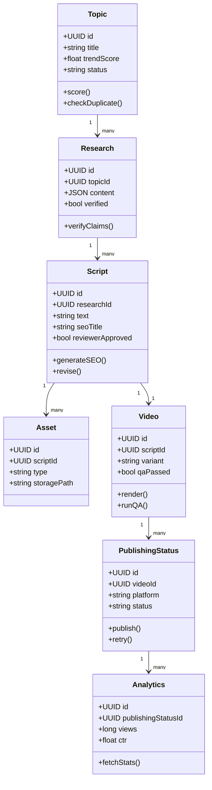

### 16.10 Gantt Chart — Implementation Plan

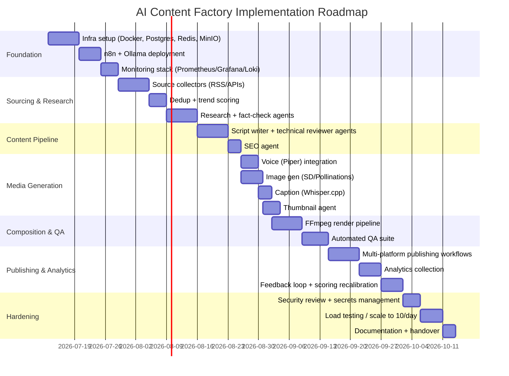

---

## Appendix: Recommended Build Order

1. Stand up Docker Compose stack (Postgres, Redis, MinIO, n8n, Ollama) and confirm health checks.
2. Implement **WF-1 (Topic Discovery)** end-to-end first — it's the cheapest to validate and unblocks everything downstream.
3. Build the Research → Fact-Check loop (**WF-2/WF-3**) with a small, cheap model before wiring in the larger script-writing model — this keeps iteration fast.
4. Get one full video rendered manually (script → voice → image → FFmpeg) before automating **WF-5/WF-6**, so the FFmpeg timeline logic is validated against real assets.
5. Wire publishing (**WF-7**) to a single platform (YouTube) first; add other platforms once the pipeline is stable.
6. Layer QA (**Section 11**) and Error Recovery (**WF-10**) in before increasing publishing cadence beyond 1/day.
7. Only after 1 video/day is reliable for 2+ weeks, invest in the scaling work from Section 13.
